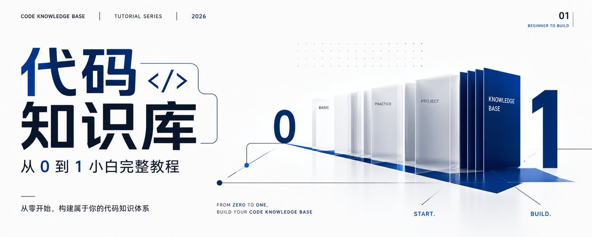

我在本地跑通了一件事：把一个几百个文件的 Agent 项目，变成了一份 AI 能直接查询的结构地图。

Claude Code 再打开这个项目时，不用从头翻文件了。它先查图谱，搞清楚模块之间的关系，再读真正需要的几个文件。

整个过程从下载到能用，不到半小时。这篇教程会手把手带你走完每一步。不需要懂图数据库，不需要买新机器，你现在用的电脑就行。

## 这篇教程会带你做什么

一句话版：给你的代码项目建一个 AI 能看懂的结构地图，以后每次改代码、接新模块、追调用链，AI 都能先看地图再动手。

做完之后你会拥有：

- 一个自动解析了你所有代码结构的本地服务
- Claude Code 或 Codex 能直接查询你的项目架构、调用关系、改动影响
- 代码有变动自动更新，不用手动维护

## 开始之前，先搞懂三个概念

你不需要背下来，看一遍有个印象就行，后面实操时会反复遇到。

### 概念一：代码图谱是什么

把你的代码想象成一座城市。每个函数、每个类、每个文件都是一栋建筑。调用关系就是道路。代码图谱等于一张城市地图，标出了所有建筑的位置和它们之间的路。AI 拿着这张地图，不用每条街都走一遍就知道从哪里到哪里。

技术上说，就是一个工具用语法解析器读你的代码，自动识别出所有函数、类、接口和它们之间的调用、导入、继承关系，存成一张图。

### 概念二：MCP 是什么

MCP 是一套标准化的工具调用协议。你不用管它背后的技术细节。只需要知道：配好之后，Claude Code 或 Codex 就能直接调用你的代码知识库，像一个随身携带的项目手册。

类比一下：你的代码图谱是一本字典，MCP 是你递给 AI 的查阅权限。没有 MCP，AI 只能自己一页页翻代码。有了 MCP，AI 直接查字典。

### 概念三：两层记忆

光有结构关系不够。图谱知道函数 A 调用了函数 B，但不知道为什么要这样设计、哪里踩过坑。所以完整的代码知识库有两层：

- 结构记忆：调用链、依赖关系、路由。程序自动从代码提取。
- 解释记忆：设计原因、历史事故、不能动的约束。你自己写 Markdown 文件维护。

两层加起来，AI 才真正理解你的项目。

## 第一步：下载工具

去 GitHub 搜 DeusData/codebase-memory-mcp，点进 Releases 页面。找最新的稳定版本，别用 latest。

根据你的系统下载对应的文件：

- macOS Apple 芯片：选 darwin-arm64
- macOS Intel 芯片：选 darwin-amd64
- Linux：选 linux-amd64
- Windows：选 windows-amd64

下载完是一个压缩包，解压后得到一个可执行文件。把它放到一个你不会删掉的目录，比如 ~/tools/。记下它的完整路径，下一步要用。

## 第二步：配置到 Claude Code

找到 Claude Code 的配置文件。在你的用户目录下：

```
~/.claude/settings.json
```

用任意文本编辑器打开这个文件。如果里面已经有内容，找到 mcpServers 这一段。如果没有，在文件里加上以下内容：

```json
{
  "mcpServers": {
    "codebase-memory": {
      "command": "/Users/你的用户名/tools/codebase-memory",
      "args": []
    }
  }
}
```

把 command 后面的路径换成你第一步放工具的实际路径。macOS 和 Linux 用户注意，路径里是你的用户名，别直接复制。

如果你用的是 Codex，配置文件的路径是 ~/.codex/settings.json，写法完全一样。

保存文件，完全退出并重启 Claude Code。这一步很多人跳过，结果发现不生效。

重启后，在 Claude Code 里输入：

> 帮我列出可用的 MCP 工具

如果能看到 codebase-memory 相关的工具名，说明配置成功。

常见问题：看不到工具。检查三个地方：路径是不是绝对路径、文件有没有执行权限（chmod +x 文件名）、Claude Code 有没有完全重启。

## 第三步：第一次索引你的项目

打开 Claude Code，进入你的项目根目录。输入：

> 帮我用 codebase-memory 的 index_repository 工具索引当前项目

Claude Code 会调用索引工具，开始扫描你的项目文件。这一步做了什么：语法解析器逐个文件读取，识别出每一个函数定义、类声明、接口、方法、导入语句和调用点。然后把它们连成一张关系图。

索引时间取决于项目大小。几百个文件的项目，第一次全量索引大概几分钟。你会看到工具调用完成的提示。

## 第四步：检查有没有漏文件

索引跑完之后，先别急着用。输入：

> 帮我用 checkindexcoverage 检查 src/ 目录下的文件是不是都进索引了

这个命令会列出哪些文件被跳过了，以及为什么跳过。常见原因三种：

- 文件太大，超过了默认的大小限制
- 被 gitignore 排除了
- 你的编程语言有些语法解析器暂时不支持

漏掉的核心文件不补回来，后面查"谁调用谁"的结果就不可靠。尤其是业务模块和公共工具函数，必须确认进了索引。

如果发现重要文件被跳过，去工具的项目 README 里查配置参数，调整文件大小上限或排除规则。

## 第五步：开始日常使用

索引没问题，现在你的 Claude Code 多了几个能力。以下是最常用的五个场景。

### 场景一：接手陌生模块，先看项目全貌

> 帮我用 get_architecture 看一下这个项目的整体结构

一个命令拿回：项目用了什么语言、有哪些包、入口文件在哪里、路由清单、核心模块和热点区域。AI 先看这张地图，再决定细读哪些文件。

### 场景二：改代码之前，先看影响范围

你改了一个函数的签名。在提交前，先让 AI 看看影响：

> 我改了 GatewayClient 里的 post 方法，帮我用 detect_changes 分析一下 git diff，看看哪些地方受影响

工具会沿着调用关系一层层往外查，列出所有受影响的函数和模块。这个检查以前靠经验和记忆力，漏一个是一个。

### 场景三：追一条调用链

> 帮我用 trace_path 查一下，从 OrderController.create 到 PaymentGateway.charge 的完整调用路径

以前要在十几个文件之间来回跳。现在一个命令拿回整条路径。

### 场景四：查某个函数被哪些地方调用

> 帮我用 search_graph 搜一下 PaymentService.charge，找它的所有调用方

结果不会把注释和文档里的同名文本也捞出来。它知道这个函数属于哪个模块，只返回真正的调用关系。

### 场景五：只读需要的那段源码

AI 不需要读整个文件：

> 帮我用 getcodesnippet 取 PaymentService.charge 的源码

只拿需要的片段，上下文窗口省下来做更重要的事。

这五个场景配合起来的用法是：图谱先定位缩小范围，关键细节再回源码确认。两个一起用，比单独靠任何一个都可靠。

## 关于自动更新

工具自带一个后台文件监听。你提交代码、切换分支、编辑文件，它自动检测、自动增量更新索引。不需要记着重跑。

但是，自动更新不等于自动正确。如果索引过程出错，旧索引应该继续服务，同时提醒你"数据可能过期"。这个工具的增量更新和状态检查已经做了，但如果你想用在生产环境，原子切换和失败报警还得自己补。

我后续打算把它装到一台 miniPC 上，24 小时跑着，当成我个人的代码知识服务。本机配好 MCP，出门也能用。

## 自己动手补上"为什么"

代码图谱只管结构关系，不管设计原因。你需要自己维护一套解释文档。

我的做法是在项目根目录建一个 knowledge/ 文件夹：

```
knowledge/
├── overview.md          # 项目总览
├── architecture.md      # 架构设计
├── decisions/           # 关键决策记录
│   └── 为什么支付分两步.md
└── gotchas/             # 踩过的坑
    └── 那个校验不能删的原因.md
```

全部用 Markdown 写，跟代码一起进 Git。AI 整理初稿，重要判断你自己确认。

## 三个限制，用之前心里有数

静态分析有盲区。 反射调用、运行时注册、消息队列消费、动态 import，这些靠静态解析抓不全。图谱说"没有调用方"，可能只是它没看见。否定结论一定回源码确认。

不是远程服务。 工具装在本机，走本地进程通信。外面那台电脑不能直接访问。想给其他设备用，需要自己加 HTTP 网关和权限控制。

只覆盖支持的编程语言。 Tree-sitter 支持很多语言，但不是每种都同样精准。TypeScript、Python、Java、Go、Rust 的解析质量较高。小众语言或框架特有语法，建议先拿自己的项目实测一下覆盖情况。

## 操作清单

1. 去 DeusData/codebase-memory-mcp 的 Releases 页下载对应系统的二进制文件
2. 解压到固定目录，记下绝对路径
3. 编辑 ~/.claude/settings.json，在 mcpServers 中加入 codebase-memory 的配置
4. 完全退出并重启 Claude Code
5. 输入"帮我列出可用的 MCP 工具"确认配置生效
6. 进入项目目录，执行 index_repository 进行首次索引
7. 用 check_index_coverage 检查关键目录覆盖情况
8. 日常使用：get_architecture、search_graph、trace_path、detect_changes、get_code_snippet
9. 在项目里建 knowledge/ 目录，维护设计原因和决策记录
10. 后续考虑装到 miniPC 上 24 小时跑

## 延伸资料

- [codebase-memory-mcp](https://github.com/DeusData/codebase-memory-mcp)
- [Codebase-Memory 论文](https://arxiv.org/abs/2603.27277)
- [MCP 标准传输规范](https://modelcontextprotocol.io/specification/2025-11-25/basic/transports)

<!-- x2doc:source -->

> 原文链接：[查看原文](https://x.com/ma_zhenyuan/status/2081364662818599028)
> 抓取时间：2026-07-27T01:27:20.262767+08:00
