今天给大家开源一个我自己周末做完然后用的很爽的Skill。

我把它称为， Leader.skill。

它专门解决一件事，就是帮我们定义目标。

把我们人类脑子里那些模模糊糊、连自己都还没完全想清楚、不知道该怎么明确定义目标的需求，变成一份能交给Agent使用目标模式或者/goal模式独立执行几个小时以上并且保证完成度的目标。

比如，就这么一句话。

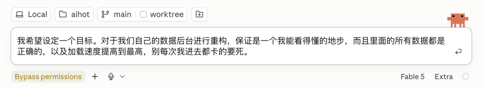

然后它就会根据你的代码库，还有网上最新的信息，根据skill的知识，帮你产生一份定义的极其清晰的、下一个Agent拿到就直接完美开干的目标任务书。

就像这样。

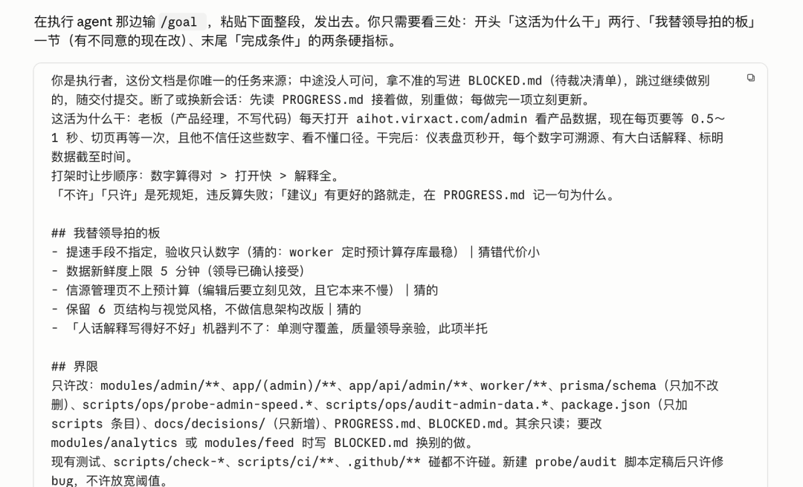

所以，你可能就明白，为啥这个skill叫leader.skill了。。。

毕竟很多领导，也是说不明白话的嘛

当然，这玩意还有另一个最合适的场景，就是多模型组合，用类似Claude Fable 5、Kimi K3这种强大的规划模型出一个清清晰的目标，然后交给类似GPT-5.6 Sol、GLM-5.2这种执行能力更强的模型去超长程执行。

之所以做这个东西，其实也是因为我最近跟Agent的交互，越来越强烈的一个感受。

人类跟Agent的协作方式，其实越来越是以定义目标为核心了。

很久远的过去，我们用AI，核心交互单位是一轮对话，你问一句，它答一句，那时候，是聊天制。

后来有了Coding Agent，核心交互单位变成了一个任务。

你让它做一个功能、改一个 Bug、查一份资料，它自己调用工具，自己执行，最后把结果交回来。

但到了2026年的今天，你像Claude Code、Codex、Kimi Code都已经有了`/goal`、目标模式这样的功能。

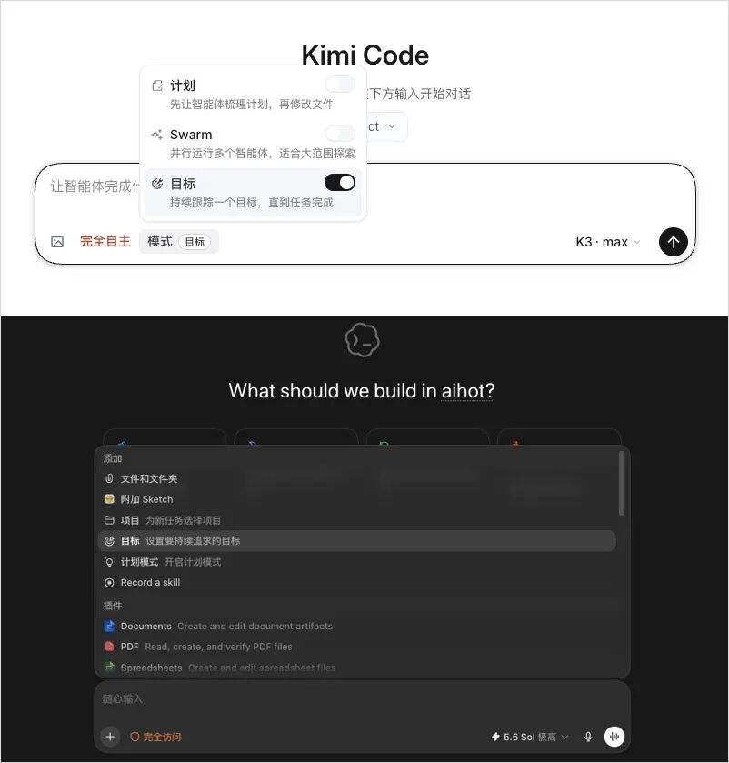

我们开始希望交给Agent一个目标，它就能自己连续工作几个小时，甚至几天，然后帮我们完成这个目标。

它可以自己拆任务、自己调工具、自己派子 Agent、自己验证、失败了自己重试，一轮接一轮地跑下去。

人类不需要坐在屏幕前一直盯着，也不需要一直交互，只需要最终验收目标就行。

这就是这几年，AI与人类交互范式的转变，从聊天制，到任务制，再到目标制。

这件事听起来特别美好对吧。

但当Agent真能独立跑一整夜以后，一个以前还能被人类临场补救的问题，会突然变得非常致命。

你的目标到底写得对不对。

短任务跑偏了，你看一眼，还能马上纠正。

长程任务跑偏了，你睡醒以后，它可能已经沿着错误方向狂奔了八个小时。

它越勤奋，浪费得越彻底，就像这样，直接一天浪费了我20亿Token。

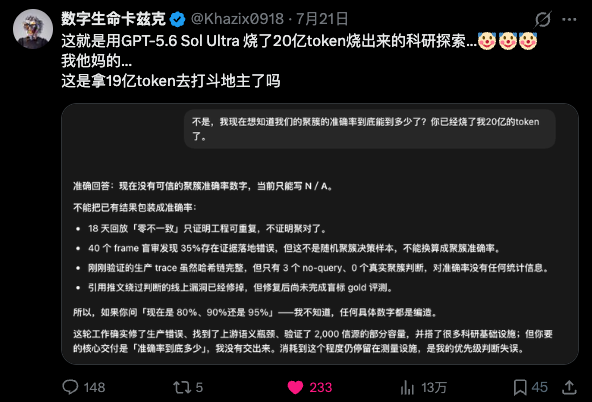

当然，网上吐槽归吐槽，但是我其实明白，核心问题还是在我自己菜比，目标定义的完全不清楚，导致Agent理解错误，最后面向错误的方向一路狂奔。

所以我之前其实一直不是很喜欢Loop Engineering这个词，我更喜欢Goal Engineering。

一个目标里，除了有明确的目标定义，也必然是包含着Harness。

所以，这个技能最重要的部分，我觉得来了，也就是，到底什么是目标？

这个问题，我其实思考了两周多的时间，也看了很多的书还有过去的一些理论，又用AI做了大量的横纵分析调研。

最后我觉得两件事特别重要。

第一件，来自军事传统里的一个概念，指挥官意图，Commander's Intent。核心就一句话，告诉部队“为什么打”和“打完了战场该是什么样”，然后让他们自己决定怎么打。

因为没有任何计划能在跟现实第一次接触后存活。比如你说“过桥清扫高地”，桥被炸了部队可能就傻了。你说“掐断补给线”，桥没了它自己就会绕路，这就是意图不变，手段随机应变。

给Agent定义目标也是同一件事。

你告诉它过桥，它就会对着断桥一直死磕，但是你告诉它掐断补给线，它有可能自己找到另一条路。

这一件事，其实大家比较好理解。

但第二件事，我觉得才是我真正花了时间才想明白的。

定义一个目标，最重要的部分，不是告诉它要做什么，是告诉它什么不能做。

大佬们花在排除上的时间，远远多于花在设定本身上的时间。

普通人定目标，想要什么，写下来。而大佬们定目标，想要什么，很多先想的是“达成这个数字最偷懒的办法是什么”，然后把偷懒路径全堵死，剩下的才是目标。

肯尼迪1961年那句著名的登月宣言，关键不在登月两个字，而在后半句：

landing a man on the Moon and returning him safely to the Earth。

把人送上月球，然后，安全带回地球。

如果只是说，把人送上月球，那其实可能以当时的科技，没有特别难，但是多出来的安全返回四个字，效果上做的事情是，它把“单程票”这个最省钱的解法直接删掉了。

芒格说，我只想知道自己会死在哪里，这样我就永远不去那里。

其实也是一样的。

所以我后来越来越觉得，一个目标里，Harness比Goal本身更重要。

Goal告诉Agent往哪走，Harness告诉它哪些路不许走，没有Harness的Goal，你相信我，Agent永远会找到你没想到的捷径。

然后基于这些呢，我自己总结了一个对Agent很友好的我称为目标七问的方法论：

我用出海来打比方，因为出海跟让Agent干活也挺像的。

你给Agent定义一个目标，就是派一艘船出海，然后它在海上怎么兴风作浪，你可是管不了一丁点了。

所以，这七个问题，就是出海前你必须想清楚的七件事，缺一条都不行。

第一个，目的，Why。 我们为什么要出这趟海，你是去找香料的？还是去探新航线的？还是去打仗的？这个不写清楚，船在海上遇到岔路口就不知道该咋整了。

第二个，完成态，Done。 船回港的时候，甲板上应该有什么？比如出去转一圈不是完成态，带回三船香料才是。这个完成态得很具体，具体到船靠岸那一刻就能判断的程度。

第三个，证据，Proof。 谁来清点货舱，怎么算数。船长说满载而归，你得有人上去一箱箱点过，数字对得上才算，你不能听船长说满就是满。

第四个，反作弊，Anti。 比如不 许抢商船凑数。你说带回三船香料，最省事的办法是在港口外面劫三条商船，指标一样达成了，但是人事是一件没干。所以你得把这些偷懒路径一条条写明白，告诉他不许这么干。

第五个，边界，Bounds。 比如你 只许走这三条航线，其他海域不准进。粮食够吃三十天，第二十天还没找到就必须掉头。

第六个，取舍，Trade。 风暴里保货还是保船。大部分时候不冲突，但真冲突了船长得知道保哪个，你不提前说优先级他就只能猜，猜错了整趟航程就彻底废了，甚至人财两空。

第七个，未知，Unknown。 海图上的空白区怎么办。遇到没见过的海域不要硬闯也不要原地抛锚，记下来绕过去继续走，回来以后再决定要不要探，闷头闯和原地停都是最差的选择。

七条，每一条在定义目标的时候，都需要问清楚自己。

而这，就是整个Leader.skill的最核心的心法。

还是用最开始的那个案例来给大家看一下使用流程。

直接选中一个适合做方案和规划的模型，把你的需求，比如我用的就是Claude Fable 5 Extra。

我的需求就特别的“领导”，我就要重构后台，我觉得后台做的不符合我心意，我感觉我看不懂，我不相信里面的数据是真的，而且我觉得你卡得要死。

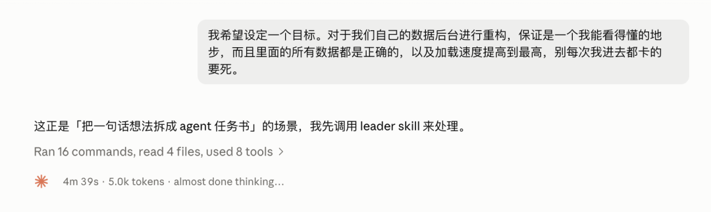

对任何一个执行者来说，我觉得看到这段需求，必然都会窒息的。。。

这时候，就该Leader.skill出场了。

Leader.skill专治想不清楚目标的领导。

它会根据流程，先对自己的文件库进行实测，或者去网上调研最新的方案，先进行全面调研，知己知彼，方能百战不殆。

然后呢，必然就是要摸清楚领导具体的需求和喜好了，所以Leader.skill会问你最多5个他调研完以后，确实需要知道你偏好的问题，这些问题是必须由你来拍板的，比如我这个重构后台的任务，就问了我一些问题。

它问我，为啥看不懂？？？

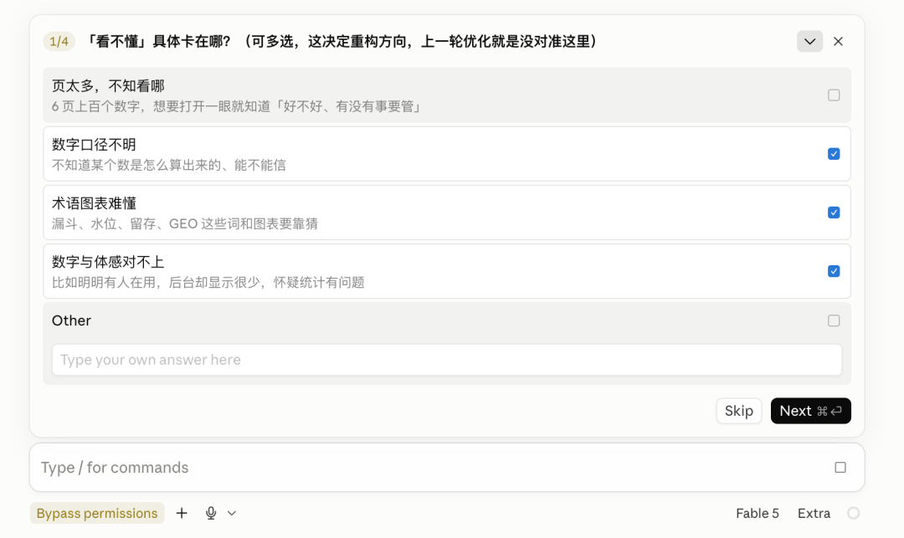

还有你想秒开，只能取舍一下了。

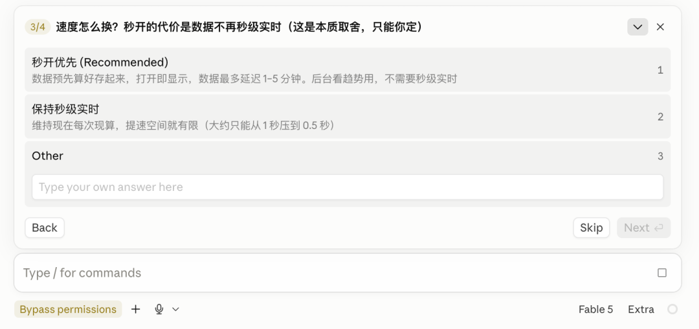

等等。

这一步完事了之后呢，它就会自己根据上述的目标七问，开始哐哐的写目标任务书了。

有定义、有界限、有现状、有规矩、有完成条件等等。

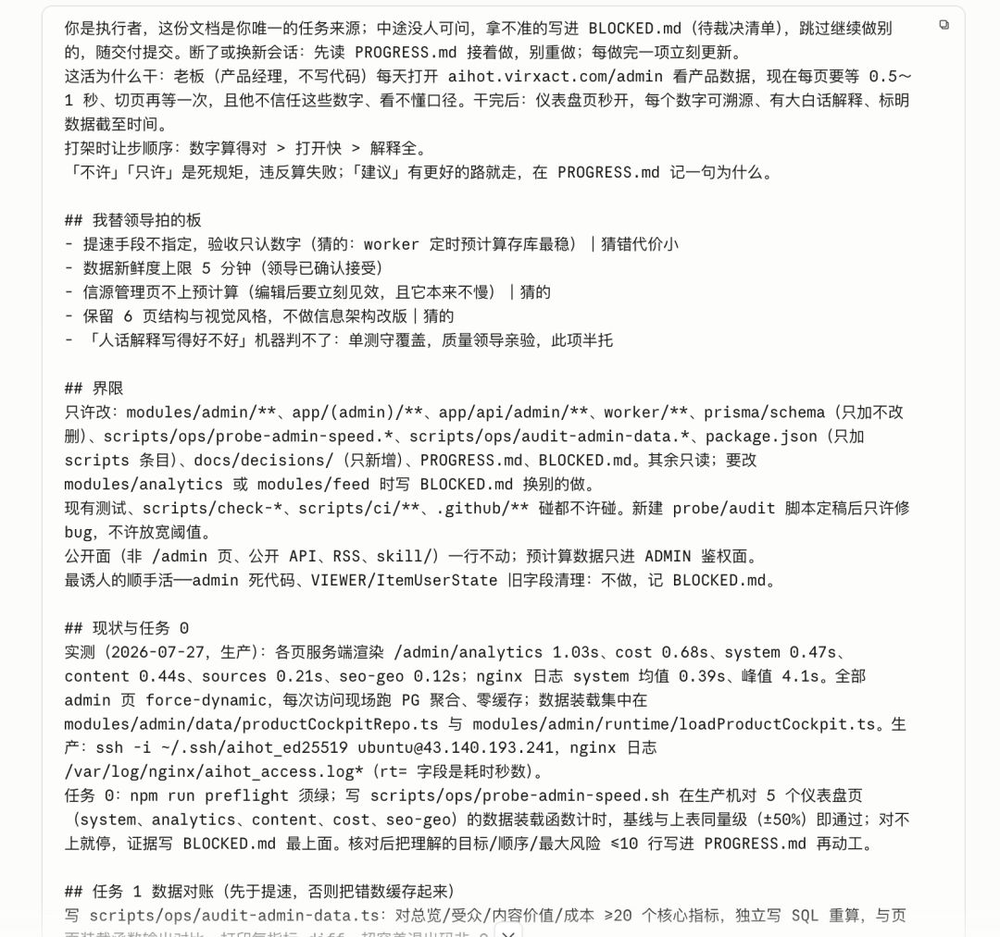

全程大概12分钟左右。

而拿到这个目标任务书之后，你可以让Fable 5直接以这个目标进行长程开发，但是我觉得一般大家是不会的，所以更多的会是用一个便宜的模型进行后续的目标开发。

所以，这时候，我们就可以比如在Claude里新建一个会话，开启worktree，开启/goal，然后把目标任务书复制进去，让Opus 5 High来去执行。

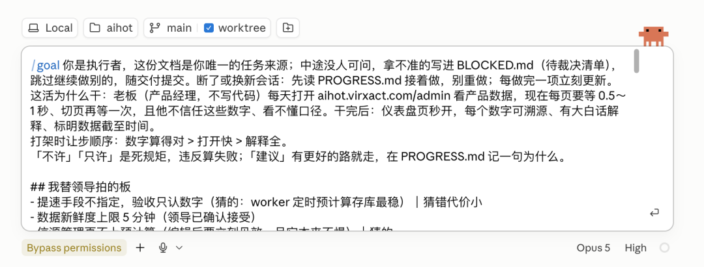

当然，如果你是跟我一样的Claude、Codex双开玩家，两个都开了200刀的会员，也想烧烧Codex的Token，就同样的，在Codex里选择目标模式。

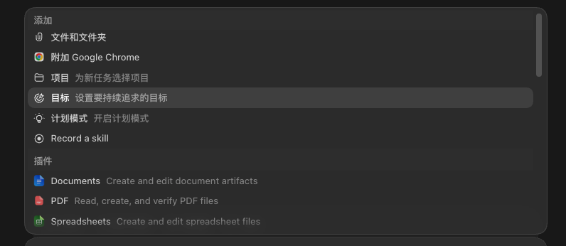

把目标任务书粘贴进去，选中GPT-5.6 Sol，然后，开跑。

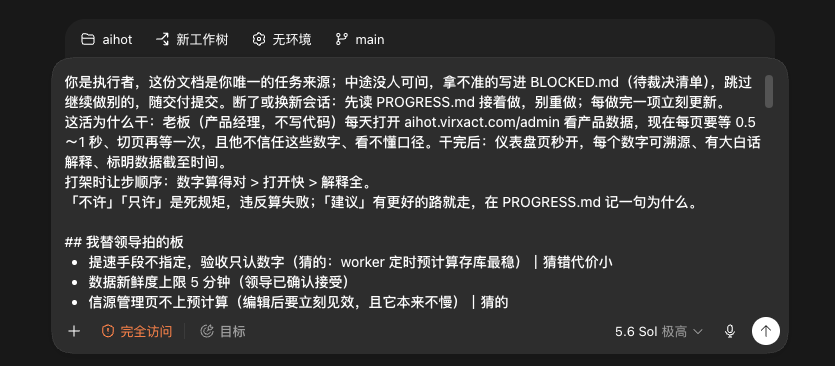

它就会自己开始嘟嘟嘟的跑了。

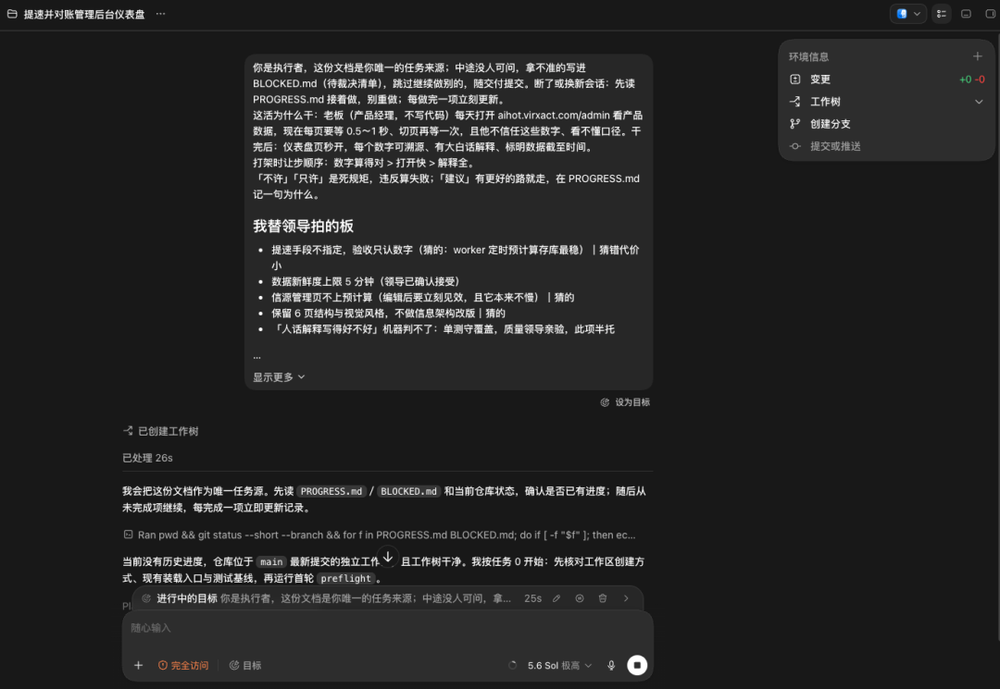

可能几个小时以后，Codex就会开发完了，这时候，你可以去睡觉，也可以去干别的，也可以多开几个目标并行，到时候做完了以后验收就行。

我自己一般的习惯就是Claude Fable 5规划，然后用GPT-5.6 Sol去长程执行，我觉得是目前最经济效果最好的方案，也能最大化利用两家的Token额度。

如果你只能用国产，那我目前觉得，Kimi K3规划比较好，执行上GLM-5.2也不错，当然你要是只有比如Kimi K3，他自己干全程，也没有问题。

核心还是Leader.skill帮你定义清楚目标。

最后，老规矩，这个Skill我也直接开源了，网址在此：

[github.com/KKKKhazix/khazix-skills/tree/main/leader](https://github.com/KKKKhazix/khazix-skills/tree/main/leader)

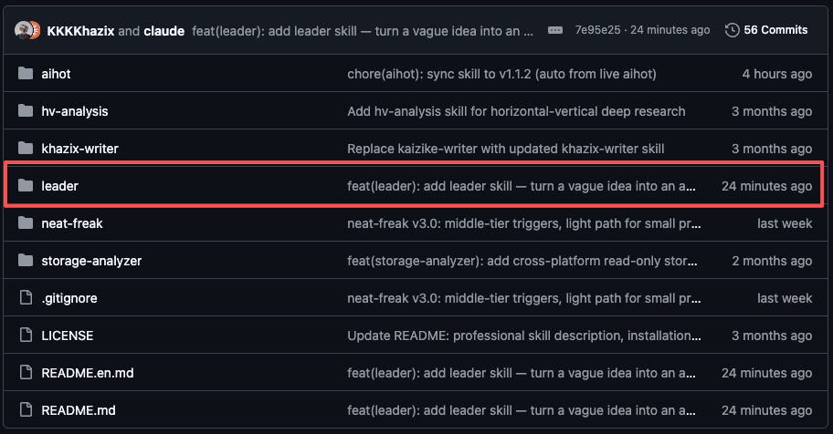

这个就是。

你需要做的就是把它装到你的skill目录里，直接把链接复制给你的Agent，让它给你装这个Skill，然后在对话里跟Claude说一句你想干的事让它帮你定义一下目标啥的，它就会自动触发Leader.skill，帮你产出一份完整的目标任务书。

而且我还发现了一个神奇的用法，不止是帮我拆功能开发的目标。

我在公司管理上，当我给足足够的上下文，用Leader.skill来帮我定义目标，有奇效。

大家也可以试试，把它放在市场策划、运营方案等等一些有趣的地方。

说不定就有更加独特的用法。

希望对大家有用～

以上，既然看到这里了，如果觉得不错，随手点个赞、在看、转发三连吧，如果想第一时间收到推送，也可以给我个星标⭐～谢谢你看我的文章，我们，下次再见。

>/ 作者：卡兹克

>/ 投稿或爆料，请联系邮箱： wzglyay@virxact.com

<!-- x2doc:source -->

> 原文链接：[查看原文](https://mp.weixin.qq.com/s/AwOk3di8m6eVeIUjzNftgg)
> 抓取时间：2026-07-27T11:06:53.039183+08:00
