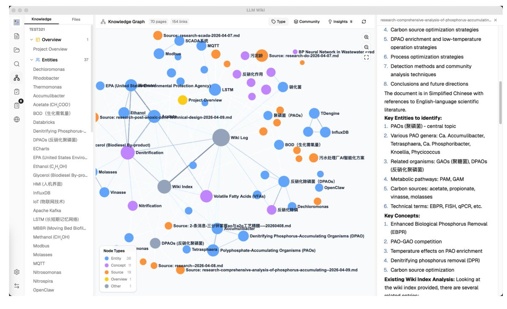

个人知识库的天花板来了！

GitHub上这个 LLM Wiki 项目已经 2800+ Star，直接把普通RAG甩几条街！
它不是每次都“重新检索”的低效模式，而是让AI直接帮你增量构建一个真正的结构化Wiki —— 知识编译一次，就持续进化、越用越聪明！

几个真正牛的点：
①

<!-- x2doc:source -->

> 原文链接：[查看原文](https://x.com/TianjiOracle/status/2056590419366932809)
> 抓取时间：2026-07-27T16:12:03.662110+08:00
